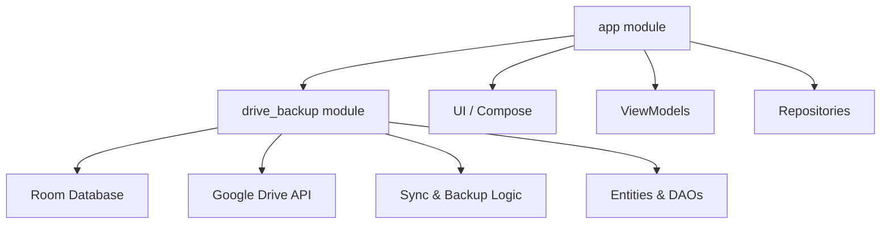

# Monetra - Your Personalized Wealth Manager

Monetra is a premium Android application designed for localized, secure, and intelligent wealth management.

## Architecture

The project follows a modular, clean architecture pattern:

### Module Responsibilities:
- **:app**: Pure UI layer, navigation, business use cases, and feature-specific repositories.
- **:drive_backup**: Core data layer (Room, Entities, DAOs) and specialized logic for Google Drive sync and cloud backup/restore.

## Tech Stack
- **UI**: Jetpack Compose (100%)
- **Navigation**: Navigation3
- **Dependency Injection**: Hilt
- **Local Storage**: Room Persistence Library
- **Background Jobs**: WorkManager
- **Cloud Service**: Google Drive API for user-owned safe backup
- **Security**: Biometric authentication & Encrypted storage

## Backup & Restore Logic
1. **Serialization**: Local Room entities are serialized into a single `BackupData` JSON object.
2. **Encryption**: The JSON is encrypted using standard Android Keystore / AES before leaving the device.
3. **Storage**: The encrypted blob is stored in the application's private hidden folder on the user's Google Drive.
4. **Restore**: On a new device, the app downloads the latest backup, decrypts it locally, and merges it back into the Room database.

## Dependency & Code Cleanup
The project has been refactored to remove redundant components:
- Deleted unused UseCases (Investment analysis, Spending predictors) to keep the core lean.
- Removed unused assets (drawables and models) and legacy Gradle dependencies (AppCompat, Material components in the library module).
- Centralized data management into the `:drive_backup` module to resolve dependency leaks.

## Build Instructions
- Use Android Studio Koala or newer.
- Gradle: 8.5+
- Minimum SDK: 30
- Target SDK: 36 (Android 15+)

## License
Proprietary - Not for public distribution.
