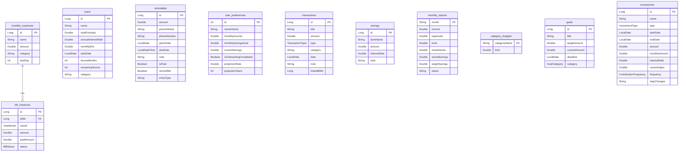

# Monetra Database Diagram

Here is the database schema for the Monetra application. It is defined using Mermaid ER Diagram syntax.

```mermaid
erDiagram
    monthly_expenses ||--o{ bill_instances : "has"

    loans {
        Long id PK
        String name
        Double totalPrincipal
        Double annualInterestRate
        Double monthlyEmi
        LocalDate startDate
        Int tenureMonths
        Int remainingTenure
        String category
    }

    monthly_expenses {
        Long id PK
        String name
        Double amount
        String category
        Int dueDay
    }

    bill_instances {
        Long id PK
        Long billId FK
        YearMonth month
        Double amount
        Double paidAmount
        BillStatus status
    }

    refundable {
        Long id PK
        Double amount
        String personName
        String phoneNumber
        LocalDate givenDate
        LocalDateTime dueDate
        String note
        Boolean isPaid
        Boolean remindMe
        String entryType
    }

    user_preferences {
        Int id PK
        String ownerName
        Double monthlyIncome
        Double monthlySavingsGoal
        Double currentSavings
        Boolean isOnboardingCompleted
        Double projectionRate
        Int projectionYears
    }

    transactions {
        Long id PK
        String title
        Double amount
        TransactionType type
        String category
        LocalDate date
        String note
        Long linkedBillId
    }

    savings {
        Long id PK
        String bankName
        Double amount
        Double interestRate
        String note
    }

    monthly_reports {
        String month PK
        Double income
        Double expenses
        Double emis
        Double investments
        Double actualSavings
        Double targetSavings
        String status
    }

    category_budgets {
        String categoryName PK
        Double limit
    }

    goals {
        Long id PK
        String title
        Double targetAmount
        Double currentAmount
        LocalDate deadline
        GoalCategory category
    }

    investments {
        Long id PK
        String name
        InvestmentType type
        LocalDate startDate
        LocalDate endDate
        Double amount
        Double monthlyAmount
        Double interestRate
        Double currentValue
        ContributionFrequency frequency
        String stepChanges
    }
```
