# Spend Sense

**Spend Sense** is a sophisticated, privacy-focused financial management application built with
modern Android development practices. It empowers users to take full control of their personal
finances through comprehensive tracking, logical insights, and secure data management.

## App Tour & Graphic Previews

Here is a detailed, screen-by-screen breakdown of **Spend Sense**.

### 1. The Command Center

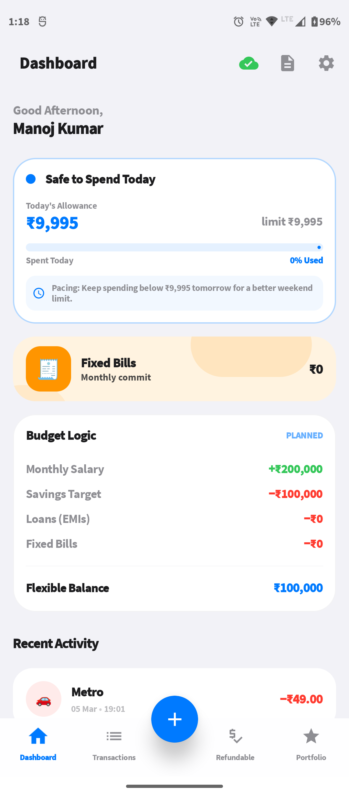

An immediate, powerful overview of your financial health.

- **Safe to Spend**: Dynamically calculates your daily spending limit by subtracting fixed bills and
  savings from your income.
- **Liquid Bar**: A visual progress bar detailing how close you are to exhausting today's spending
  rhythm.
- **Monthly Waterfall**: A clear breakdown of how your income is distributed across EMIs, fixed
  bills, and free cash.

### 2. Comprehensive Ledger & Smart Tracking

|                                                              |                                                         |
|:------------------------------------------------------------:|:-------------------------------------------------------:|
|   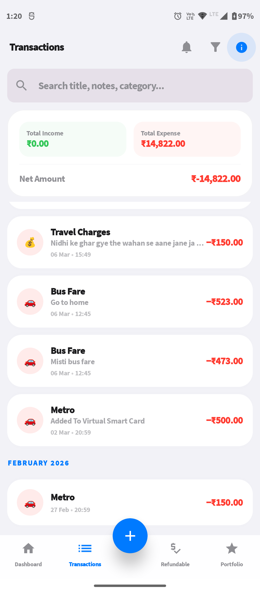   | 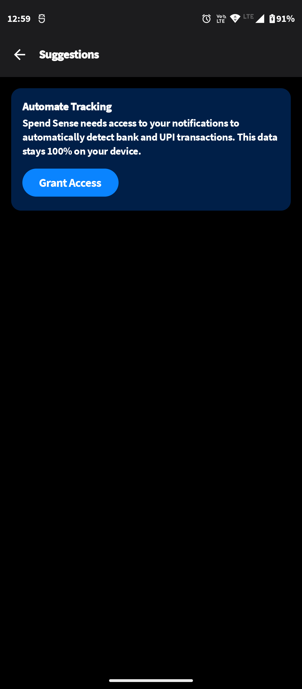 |
| 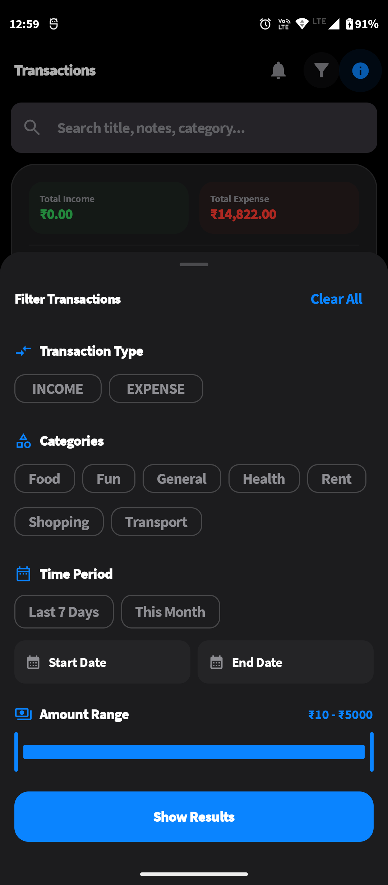 |                                                         |

A chronological timeline of every spent or earned penny.

- **Fluid Gestures**: Swipe to delete or modify records with immediate undo support.
- **Automated Detection**: Parses bank notifications and SMS to suggest pending transactions,
  awaiting your approval.
- **Advanced Filtering**: Instantly filter your timeline by specific dates, categories, or
  transaction types.

### 3. Rapid Data Entry

|                                                  |                                                 |
|:------------------------------------------------:|:-----------------------------------------------:|
| 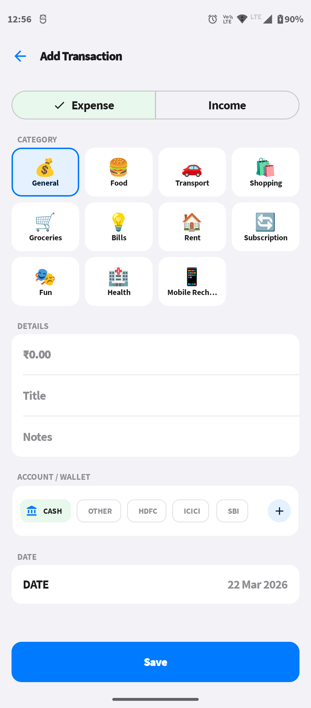 | 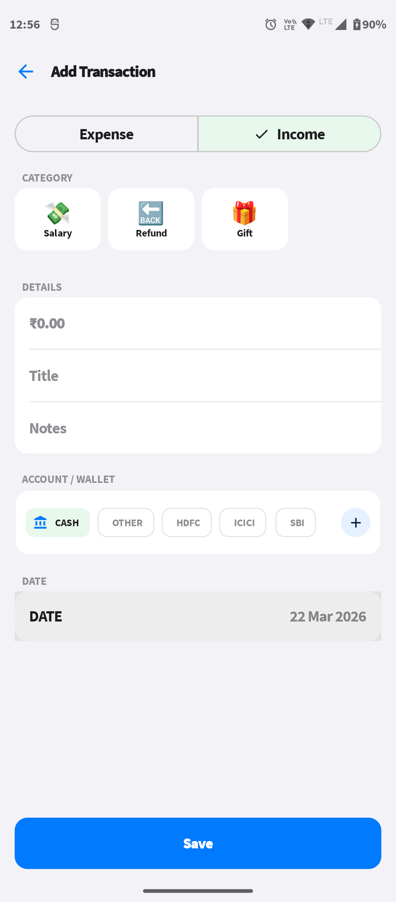 |

Log every financial movement smoothly without friction.

- **Frictionless Form**: Minimal inputs required to save an entry securely in seconds.
- **Contextual Notes**: Attach specific descriptions to remember exactly why you spent the money.

### 4. Wealth & Portfolio Management

|                                                       |                                                        |
|:-----------------------------------------------------:|:------------------------------------------------------:|
| 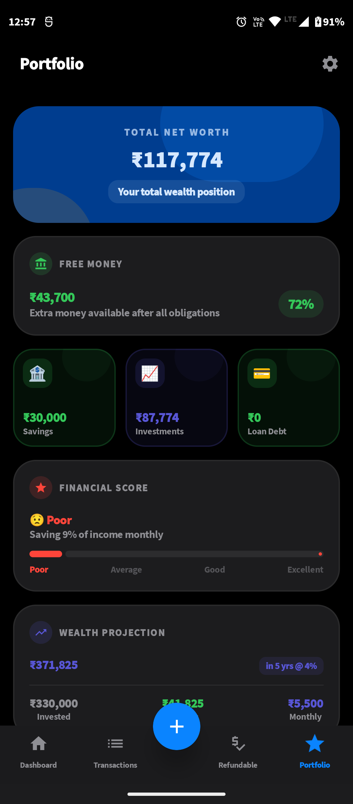 | 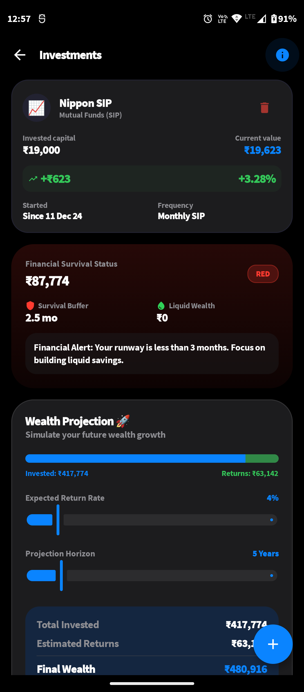 |
|  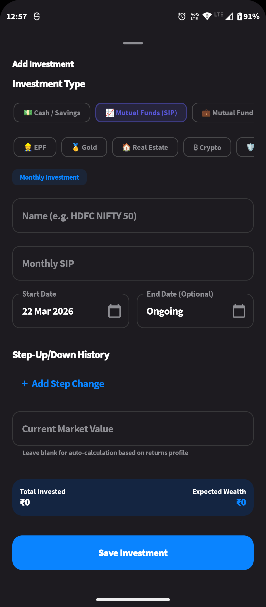  |  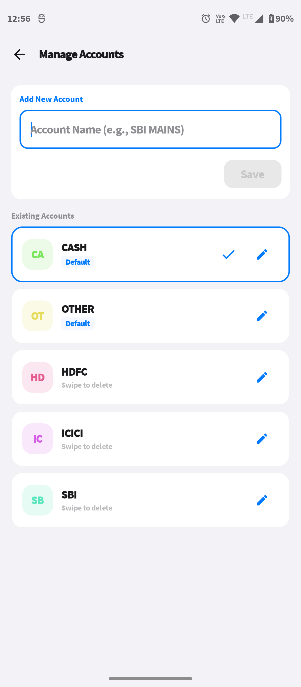   |

Watch your net worth grow efficiently.

- **Diversified Tracking**: Monitor Mutual Funds, Equity, Fixed Deposits, and Crypto from a single
  screen.
- **Compound Growth Simulation**: Calculate and project how your wealth will scale over 10+ years.
- **Account Management**: Seamlessly add new asset blocks securely.

### 5. Mandatory Commitments

|                                                          |                                                   |
|:--------------------------------------------------------:|:-------------------------------------------------:|
| 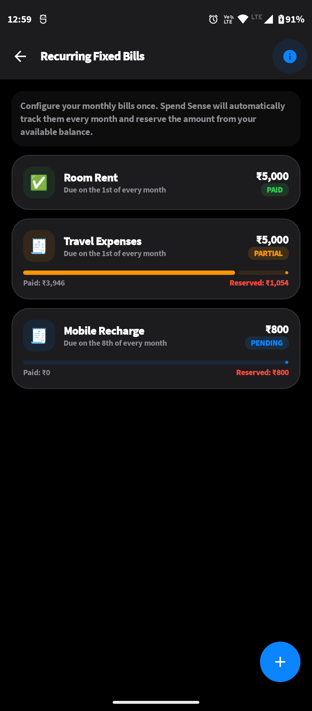 | 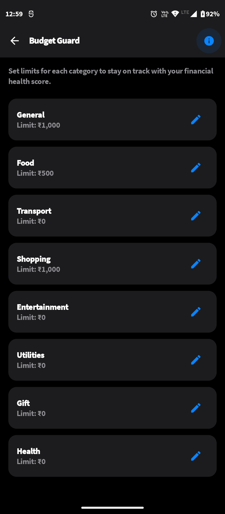 |

Ensure stability through strict enforcement.

- **Recurring Subscriptions**: Track rent, internet, and Netflix so they are safely subtracted
  before calculating your disposable income.
- **Category Guard**: Assign explicit spending caps to "Food" or "Shopping" to receive warnings
  before you overspend.

### 6. Refundables (Lent / Borrowed Money)

|                                                                |                                                         |
|:--------------------------------------------------------------:|:-------------------------------------------------------:|
| 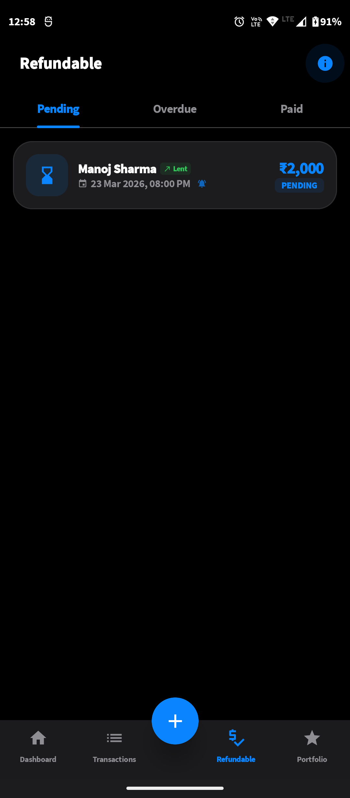 | 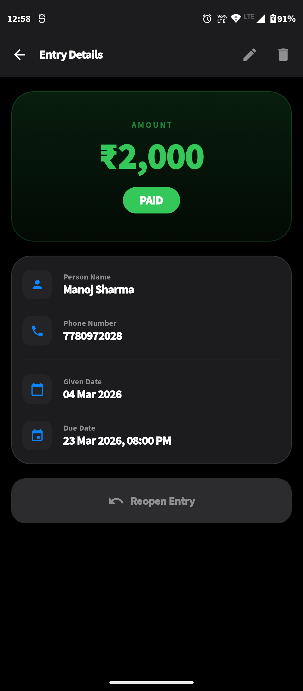 |
|     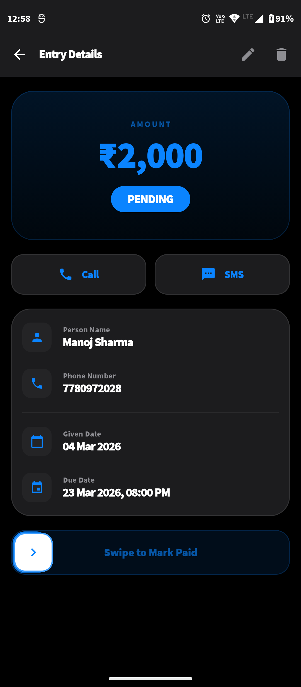     |     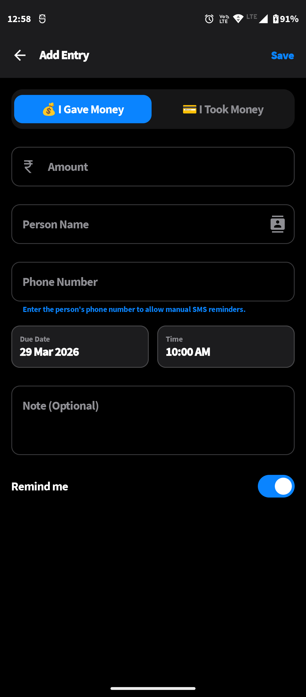     |

Isolate temporary expenses.

- **Contact Integration**: Link debts directly to people in your phonebook.
- **Separate Pool**: Money lent doesn't corrupt your daily budget math.
- **1-Tap Settlement**: Reintegrate funds the second your friend pays you back.

### 7. Security & Cloud Backup

|                                                         |                                                  |
|:-------------------------------------------------------:|:------------------------------------------------:|
|   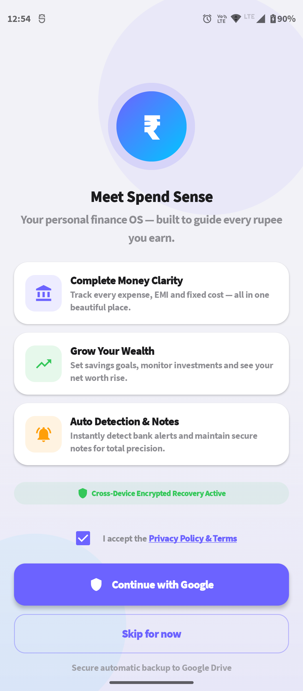   | 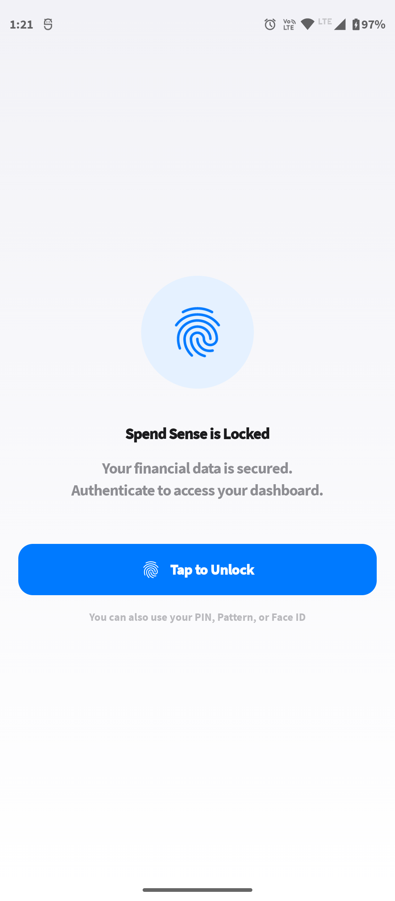 |
| 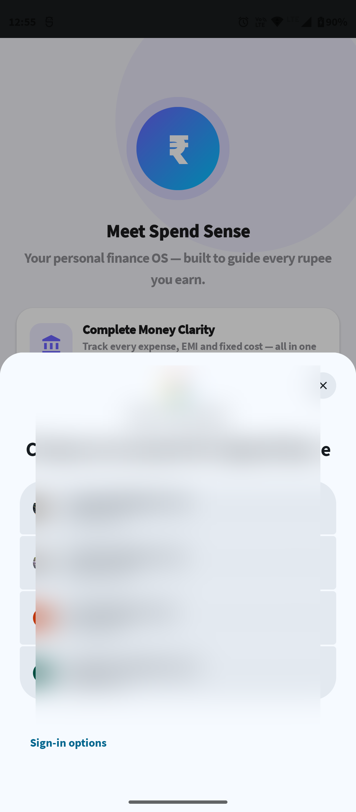 |                                                  |

Your data remains entirely yours.

- **Biometric Enforcement**: Secure the app using device fingerprint or Face ID.
- **Private Cloud Sync**: Encrypted, hidden daily backups securely pushed to the App Data folder in
  your Google Drive. We never touch your data.

### 8. Personalization & Settings

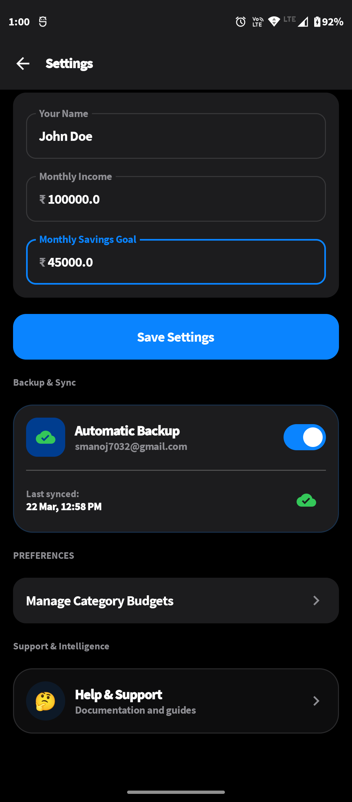

Your app, your rules.

- **Currency Selection**: Customize your base currency globally.
- **Salary Cycle Management**: Define the exact day your tracking month begins.
- **Backup Controls**: Manually trigger Google Drive synchronizations or wipe local data instantly.

## Features

*   **Comprehensive Transaction Tracking** — Log income and expenses with detailed categorization, payment modes, and timestamps.
*   **Automated Transaction Detection** — Automatically detects credit and debit alerts from bank notifications and pre-fills transaction details for quick approval.
*   **Intelligent Budgeting** — Set monthly or category-specific budget limits and receive real-time updates on your spending headroom.
*   **Investment Portfolio Management** — Track assets across various categories (stocks, mutual funds, etc.) with net worth visualization.
*   **Loan & Debt Ledger** — Maintain a clear record of borrowed and lent money, complete with due dates and settlement tracking.
*   **Personalized Financial Notes** — Attach detailed notes and descriptions to your financial records to keep track of specific contexts and reminders.
*   **Recurring Expenses & Subscriptions** — Manage fixed monthly costs and active subscriptions to ensure no payment is missed.
*   **Savings Goals** — Define financial milestones and track your progress with dedicated saving suggestions.
*   **Financial Reports** — Gain clear insights into your spending habits and receive automated financial health reports.
*   **Refundable Expense Tracking** — Specialized workflow for tracking business expenses or items awaiting reimbursement.
*   **Biometric Security** — Protect your sensitive financial data with integrated fingerprint and face unlock capabilities.
*   **Google Drive Cloud Backup** — Securely sync and restore your data using your personal Google Drive account.

## Tech Stack

*   **Language:** Kotlin
*   **UI Framework:** Jetpack Compose (Modern declarative UI)
*   **Design System:** Material 3 (with support for Dynamic Color)
*   **Architecture:** Clean Architecture + MVVM (Model-View-ViewModel)
*   **Dependency Injection:** Hilt
*   **Local Database:** Room Persistence Library
*   **Preferences Storage:** DataStore (Type-safe key-value storage)
*   **Asynchronous Logic:** Kotlin Coroutines & Flow
*   **Navigation:** Navigation3 (Experimental Jetpack Navigation)
*   **Background Tasks:** WorkManager (for periodic Cloud Backups)
*   **Cloud Integration:** Google Drive API v3
*   **Security:** Biometric API & Credentials Manager
*   **Image Loading:** Coil (implied/common in Compose projects)

## Architecture

The project follows **Clean Architecture** principles combined with **MVVM** to ensure a separation of concerns, testability, and maintainability.

*   **Presentation Layer:** Uses ViewModels to manage UI state and expose data via `StateFlow` to Jetpack Compose screens.
*   **Domain Layer:** Contains the core business logic, domain models, and repository interfaces, keeping the app logic independent of external frameworks.
*   **Data Layer:** Implements repository interfaces, manages Room database operations, handles API interactions (Google Drive), and coordinates background workers.
*   **Data Flow:** Unidirectional Data Flow (UDF) is maintained where the UI sends events to the ViewModel, and the ViewModel updates the UI state based on repository responses.

## Project Structure

```text
app/
├── data/           # Repository implementations, Room DAOs/Entities, WorkManager Workers
├── domain/         # Domain models, Repository interfaces, Use Cases
├── presentation/   # ViewModels, UI State definitions, Navigation logic
├── ui/             # Composable screens, components, and Material 3 theme styling
├── di/             # Hilt modules for dependency injection
├── service/        # Background services (Notification Listener)
└── util/           # Helper classes (Notification Parser, formatting)

drive_backup/       # Independent library module for Google Drive sync logic
```

## Key Components

* **`Spend SenseNavGraph`**: The central navigation engine managing transitions between 17+
  different screens using the latest Navigation3 API.
* **`Spend SenseNotificationListenerService`**: A background service that monitors bank
  notifications and extracts transaction data using regex patterns.
*   **`TransactionRepository`**: The primary data hub that coordinates all financial entry operations across local and remote sources.
*   **`DriveBackupWorker`**: A robust background task that ensures user data is safely backed up to the cloud without manual intervention.
* **`Spend SenseTheme`**: A customized Material 3 design implementation ensuring a premium and
  consistent aesthetic throughout the app.

## Setup & Installation

1.  **Clone the repository:**
    ```bash
    git clone https://github.com/your-username/Spend Sense.git
    ```
2.  **Open in Android Studio:**
    Use Android Studio Ladybug (2024.2.1) or newer.
3.  **Google Cloud Setup:**
    *   Create a project on [Google Cloud Console](https://console.cloud.google.com/).
    *   Enable the **Google Drive API**.
    *   Configure the OAuth consent screen and create an Android OAuth 2.0 Client ID using your local SHA-1.
4.  **Sync Gradle:**
    Allow the project to download all dependencies defined in `libs.versions.toml`.
5.  **Run:**
    Select a device with **API 30+** and click the "Run" button.

## Requirements

*   **Android Version:** SDK 30 (Android 11) or higher.
*   **Build System:** Gradle 8.0+ with KSP support.
*   **Tooling:** Kotlin 2.0.0+ and Jetpack Compose Compiler.
*   **Hardware:** Biometric hardware (optional, for security features).

## Future Improvements

*   **Multi-Currency Support:** Add ability to track accounts in different currencies with live exchange rates.
*   **Receipt Scanning:** Integrate OCR to automatically extract data from physical receipts.
*   **Enhanced SMS Parsing:** Expand detection patterns for a wider range of international banks and fintech apps.
*   **Paging 3 Integration:** Enhance transaction lists with Paging 3 for smoother scrolling in large datasets.
* **Desktop/Web Version:** Explore Kotlin Multiplatform (KMP) to bring Spend Sense to more platforms
  while sharing the domain and data logic.
